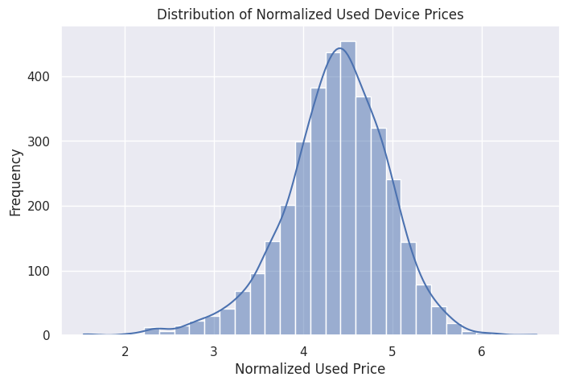
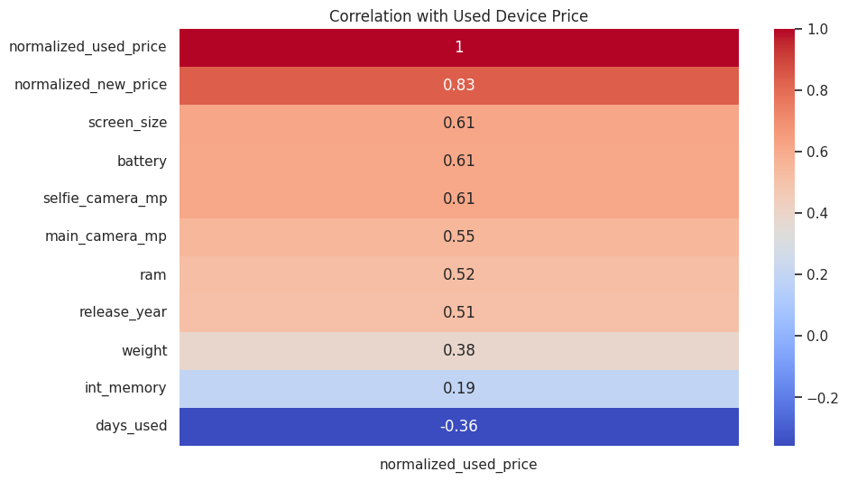
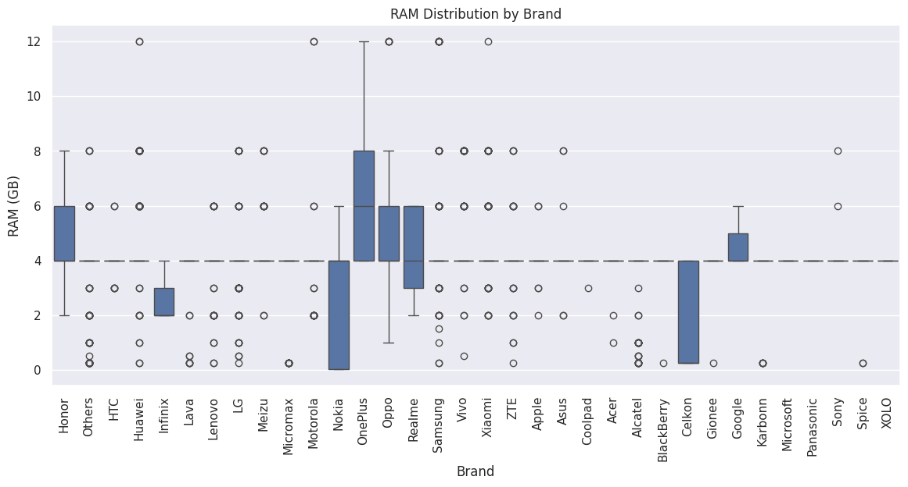
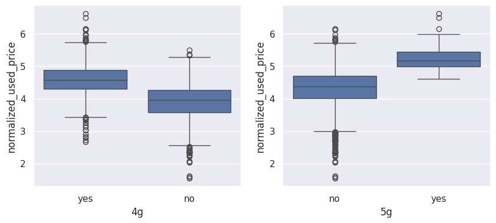
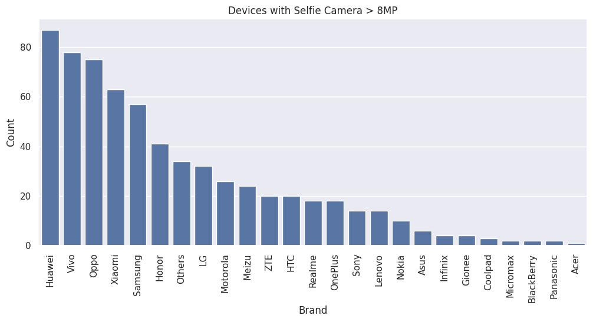

# ReCell Used Device Price Prediction
# ReCell Used Device Price Prediction

## Project Overview
This project analyzes the factors affecting the resale prices of used mobile devices and builds a Linear Regression model to predict normalized used prices.

The project includes:

- Exploratory Data Analysis (EDA)
- Univariate Analysis
- Bivariate Analysis
- Feature Engineering
- Linear Regression Modeling
- Assumption Testing
- Business Insights & Recommendations

## Dataset Features
The dataset contains information about:

- Device brand
- RAM
- Battery capacity
- Screen size
- Camera specifications
- 4G/5G support
- Release year
- Usage duration
- New device price

## Key Insights
- Android dominates the resale market.
- RAM, battery, and camera quality strongly influence resale price.
- Devices with 5G support generally retain higher value.
- Premium brands maintain stronger resale performance.

## Model
The final Linear Regression model was evaluated using regression metrics and assumption testing.

## Tools & Libraries
- Python
- Pandas
- NumPy
- Matplotlib
- Seaborn
- Scikit-learn
- Statsmodels

## Author
Liana Graham
****
## Visualizations

### Distribution of Used Device Prices

---

### Correlation Heatmap

---

### RAM Distribution by Brand

---

### 4G vs 5G Price Comparison

---

### Selfie Camera Analysis

